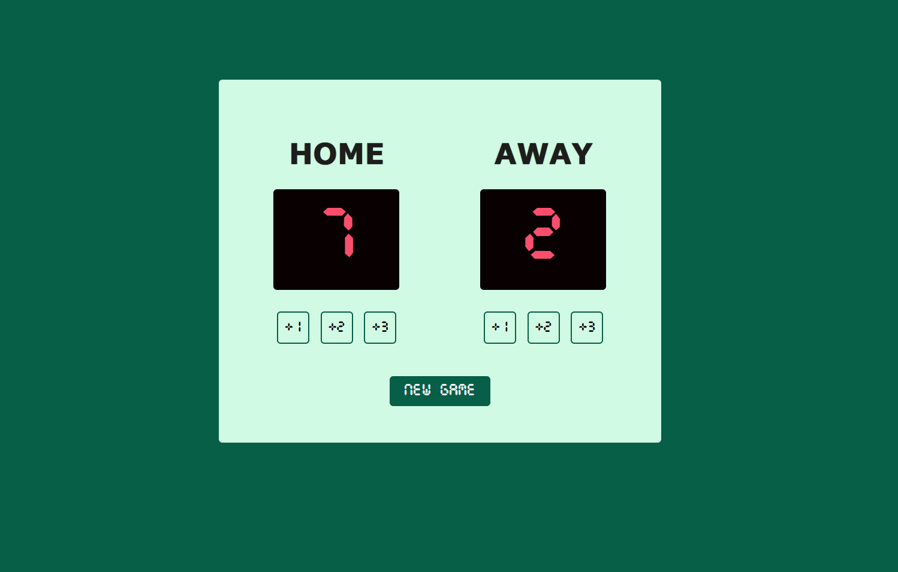

# 🏀 Basketball Scoreboard

A simple basketball scoreboard web app built from scratch using **HTML, CSS, and JavaScript**.

The app allows you to keep track of the scores for the **Home** and **Away** teams.

## 🚀 Features

* 🏠 Add **+1, +2, or +3** points to the Home team
* ✈️ Add **+1, +2, or +3** points to the Away team
* 🔄 Reset both scores using the **New Game** button
* 🎨 Simple basketball scoreboard design
* 🔢 Digital-style scoreboard using a custom font
* 🖱️ Interactive buttons using JavaScript

## 🛠️ Technologies Used

* HTML5
* CSS3
* JavaScript

## 📚 What I Learned

* JavaScript functions and variables
* DOM manipulation
* Button click events
* `textContent`
* CSS Flexbox
* Using custom fonts with `@font-face`

## 📸 Screenshot

## 🌐 Live Demo

[View Live Demo](https://basketball-score49.netlify.app/)
